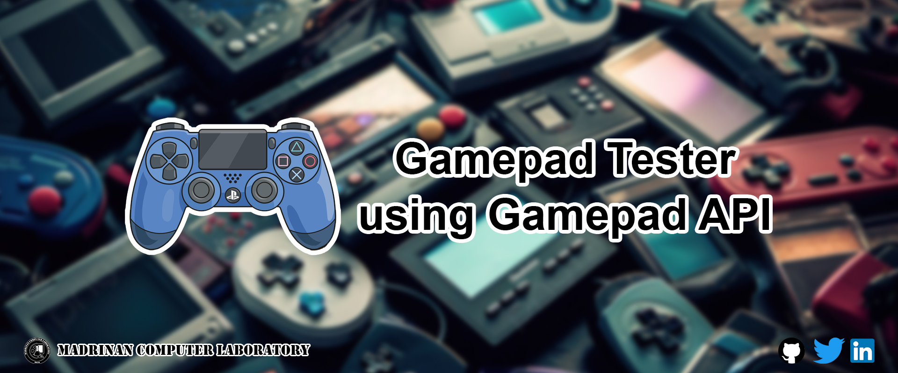
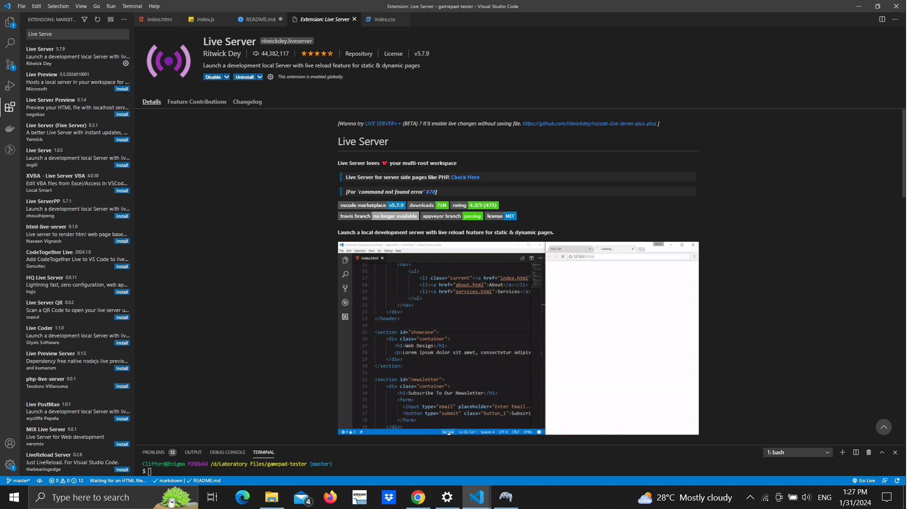
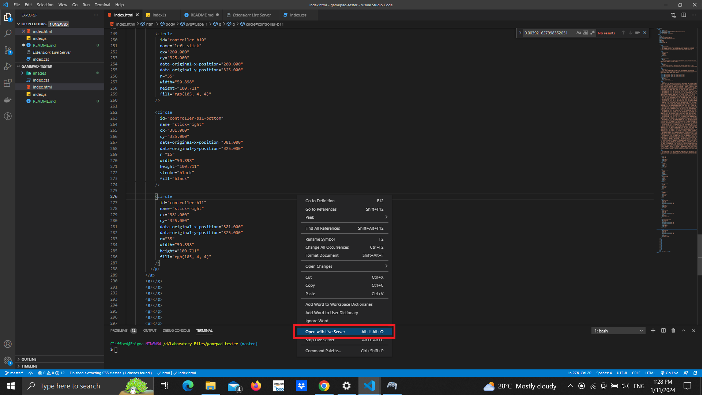
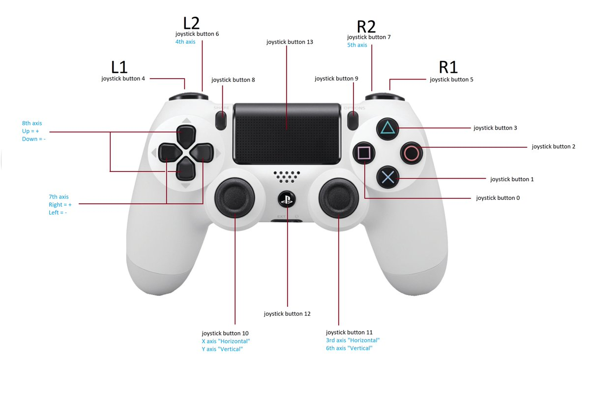

# Welcome to Gamepad Tester Experiment!

This experiment was conducted in January 31, 2024

## Introduction
This experiment aims to give an example on how to connect your controller to your web application and to map the controls.

**Disclaimer:** This research was made possible using the following sources:
- https://developer.mozilla.org/en-US/docs/Games/Techniques/Controls_Gamepad_API
- https://www.youtube.com/watch?v=UXTOXF8Y2Cs

You can see what is in the `event.gamepad` when the controller was connected and you can do it like this:
```JavaScript
window.addEventListener("gamepadconnected", (event) => {
    const gamepad = event.gamepad;

    console.log(`Your "${gamepad.id}" is now connected!`);
    console.log("Gamepad attr.:", gamepad);
});
```

Below `Gamepad attr` you will see and object like this:
```JavaScript
{
    axes: [
        // Data for left stick
        -0.9058823585510254, 
        -0.43529409170150757, 
        
        // Data for right stick
        0.003921627998352051, 
        0.003921627998352051
    ],
    buttons: [
        {pressed: false, touched: false, value: 0}, // Index 0 (first array item)
        ...
        {pressed: false, touched: false, value: 0}, // Index 17 (last array item)
    ],
    connected: true,
    id: "Wireless Controller (STANDARD GAMEPAD Vendor: 054c Product: 09cc)",
    index: 0, // You can connect up to four (4) controllers, so, 0 is the first one.
    mapping: "standard",
    timestamp: 1691.0999999996275,
    vibrationActuator: {
        type: "dual-rumble"
    }
}
```

## How to Run this App?
There were couple of ways to run this application:
**1.)** Double click on the `index.html` in your file explorer.
**2.)** You can use Live Server.
> - Make sure that you have Live Server installed in your VS Code:

> - Right-click on the `index.html` in VS Code, then select **Open with Live Server**


## Gamepad API Controls in PS4
This is not limited to PS4 Controllers only but can also be used in other types of controllers.


Previously, it was mentioned in this documentation that the object value was returned by `event.gamepad`. The `buttons` in that object pertain to all of the buttons in the controller (L1, L2, R1, R2, Circle, Square, etc.). While the `axes` pertain to the sticks in the controller (joysticks 10 and 11),.

Since the buttons and axes were stored in an array, it was difficult to identify which button represented the button in the controller. So we will identify it below:
### Buttons
- **L1 (Joystick button 4)** - event.gamepad.buttons[4]
- **L2 (Joystick button 6)** - event.gamepad.buttons[6]
- **R1 (Joystick button 5)** - event.gamepad.buttons[5]
- **R2 (Joystick button 7)** - event.gamepad.buttons[7]
- **Share (Joystick button 8)** - event.gamepad.buttons[8]
- **Options (Joystick button 9)** - event.gamepad.buttons[9]
- **Triangle (Joystick button 3)** - event.gamepad.buttons[3]
- **Circle (Joystick button 2)** - event.gamepad.buttons[1]
- **Cross (Joystick button 1)** - event.gamepad.buttons[0]
- **Square (Joystick button 0)** - event.gamepad.buttons[2]
- **DPAD Up (8th Axis Up =+)** - event.gamepad.buttons[12]
- **DPAD Down (8th Axis Down =-)** - event.gamepad.buttons[13]
- **DPAD Left (7th Axis Left =-)** - event.gamepad.buttons[14]
- **DPAD Right (7th Axis Right =+)** - event.gamepad.buttons[15]
- **Pressing Left Stick (Joystick button 10)** - event.gamepad.buttons[10]
- **Pressing Right Stick (Joystick button 11)** - event.gamepad.buttons[11]

## Axes
- **Left Stick X Axis (Pulling Up/Down Joystick button 10)** event.gamepad.axes[0]
- **Left Stick Y Axis (Pulling Left/Right Joystick button 10)** event.gamepad.axes[1]
- **Right Stick X Axis (Pulling Up/Down Joystick button 11)** event.gamepad.axes[2]
- **Right Stick Y Axis (Pulling Left/Right Joystick button 11)** event.gamepad.axes[3]

----
### Did You Like This Experiment?
Stay tuned for upcoming projects and experiments by following me on the following accounts:
<p float="left">
  <a href="https://twitter.com/MadrinanComLab">
  
  </a>
  <a href="https://www.linkedin.com/in/john-clifford-madri%C3%B1an-3b5ba222a/">
  
  </a>
</p>
